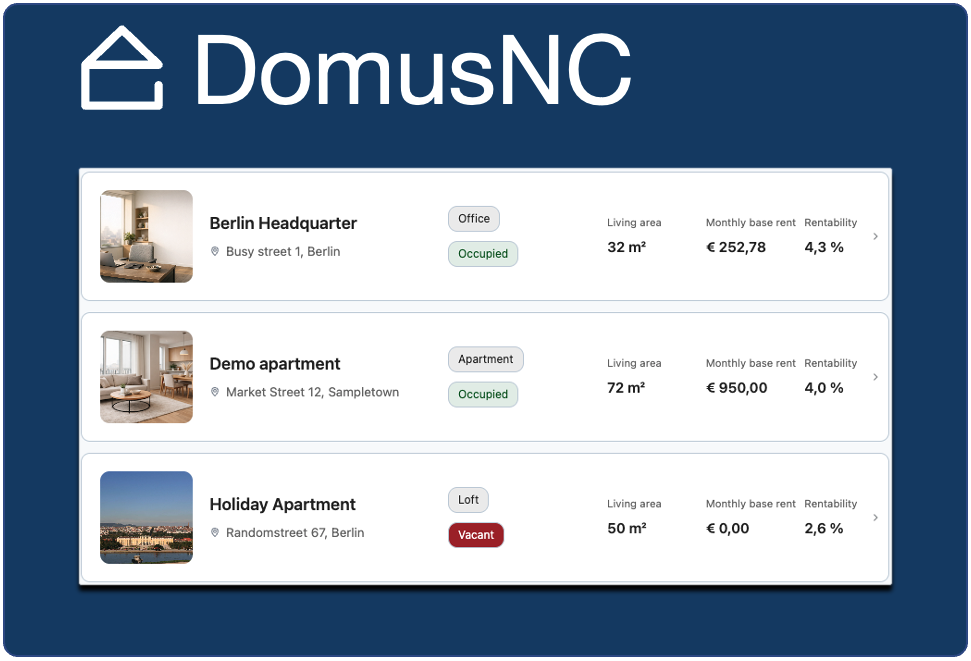
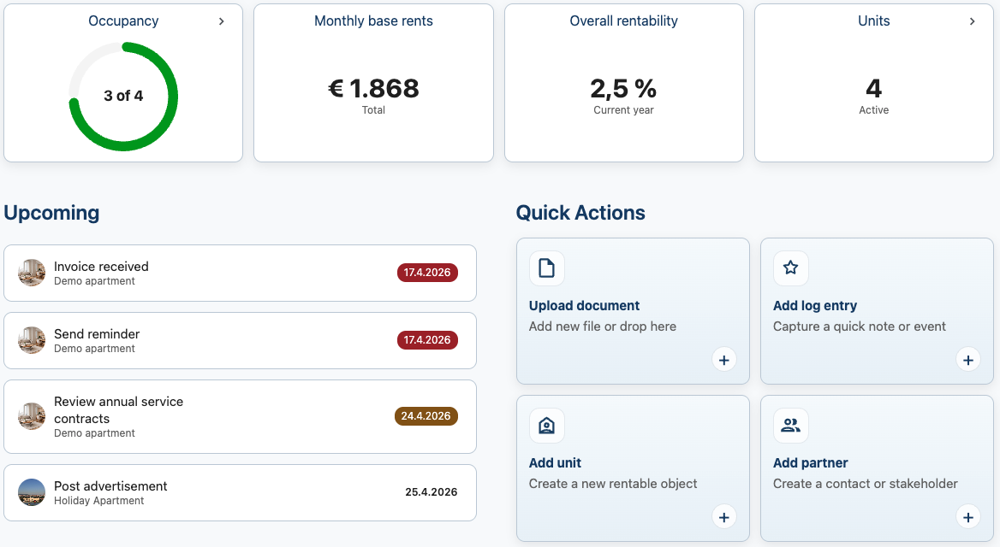
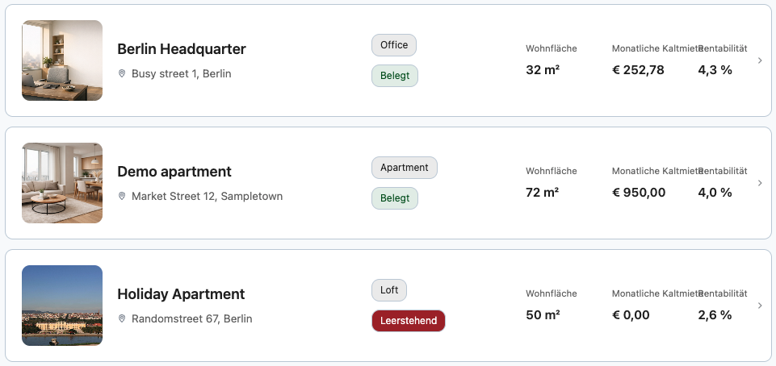
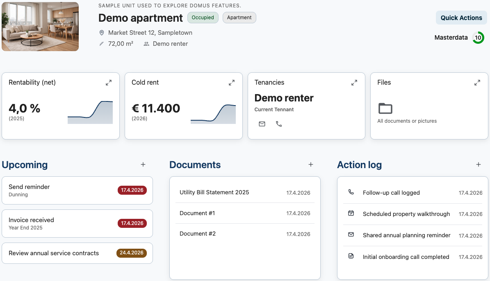
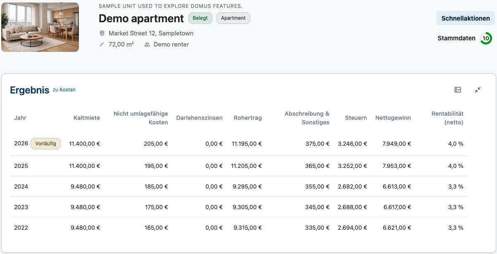

# DomusNC

Domus gives landlords one structured place for units, tenancies, bookings, documents, and dashboard visibility.
Built for teams who want clear rental workflows without giving up the privacy and convenience of Nextcloud.

## Preview

   
  
  
  
  

## Highlights
- Manage each unit with complete details and clear follow-up actions.
- Track all invoices and payments with linked documents and rentability context.
- Keep tenant and tenancy management connected to service charge reporting.
- Use dashboard and analytics views for a fast operational overview.

## Modules
- Dashboard: at-a-glance summaries, activity signals, and reporting context.
- Units & Activities: unit details, action log entries, and upcoming tasks.
- Bookings & Documents: invoice/payment tracking and linked documentation.
- Tenancies & Service Charge: tenancy tracking and service charge reporting.
- Partners & Contacts: owners, service providers, and stakeholder data.
- Tasks: assignments, checklists, and operational follow-ups.

## Languages
- EN, DE

## Maintainers
- [Marcel Scherello](https://github.com/rello) (author, project leader)

## Support
Supported by PhpStorm from [JetBrains](https://www.jetbrains.com/?from=AudioPlayerforNextcloudandownCloud)

  

