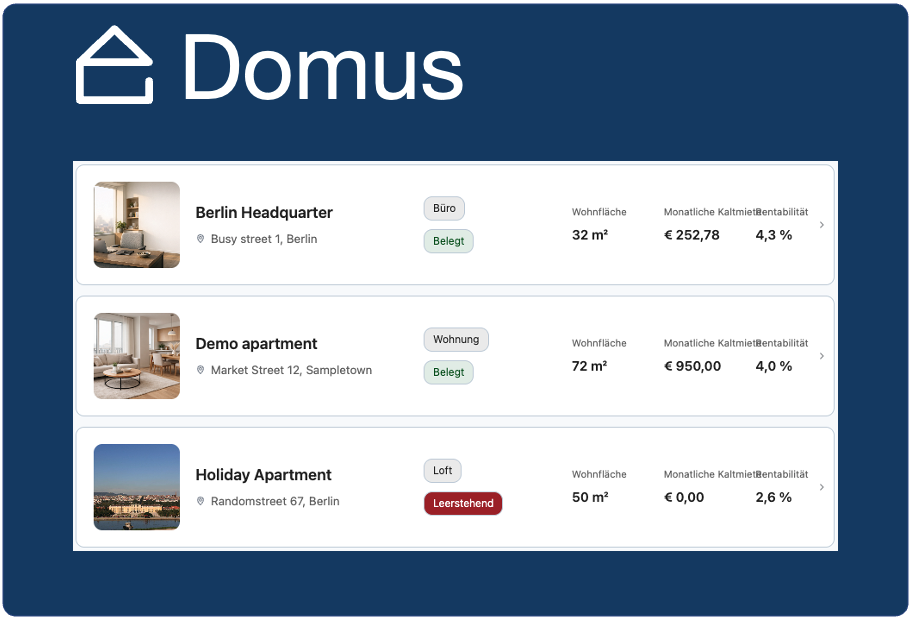
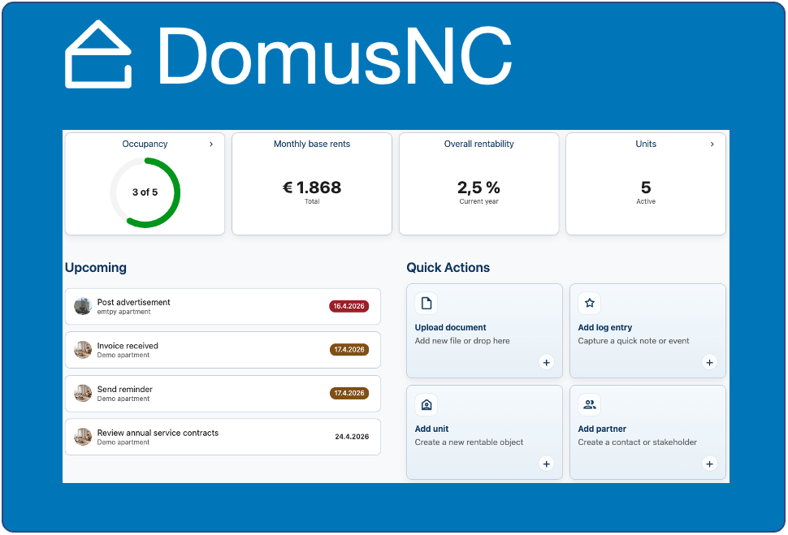
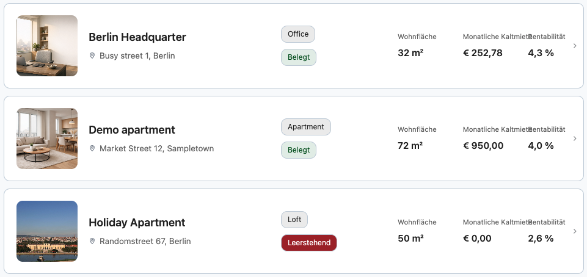
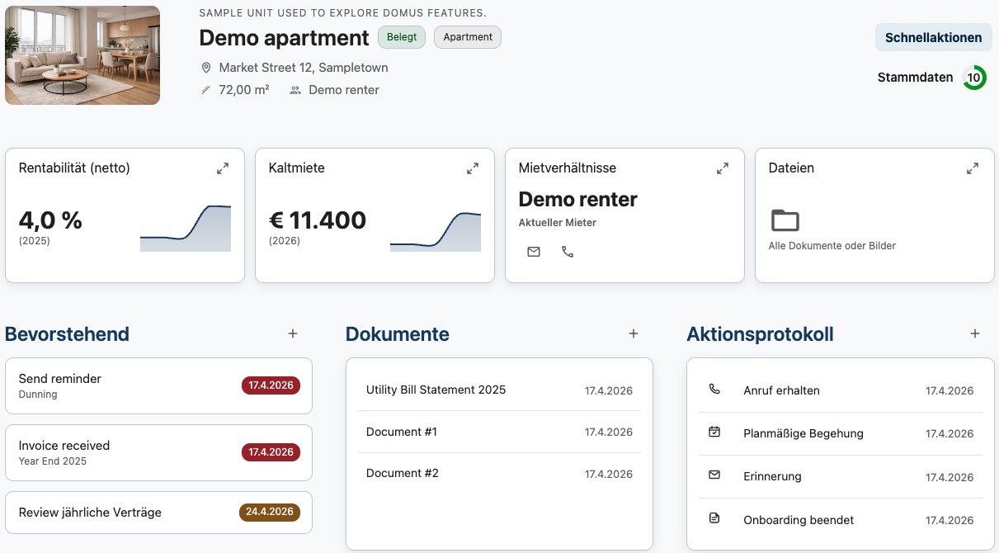
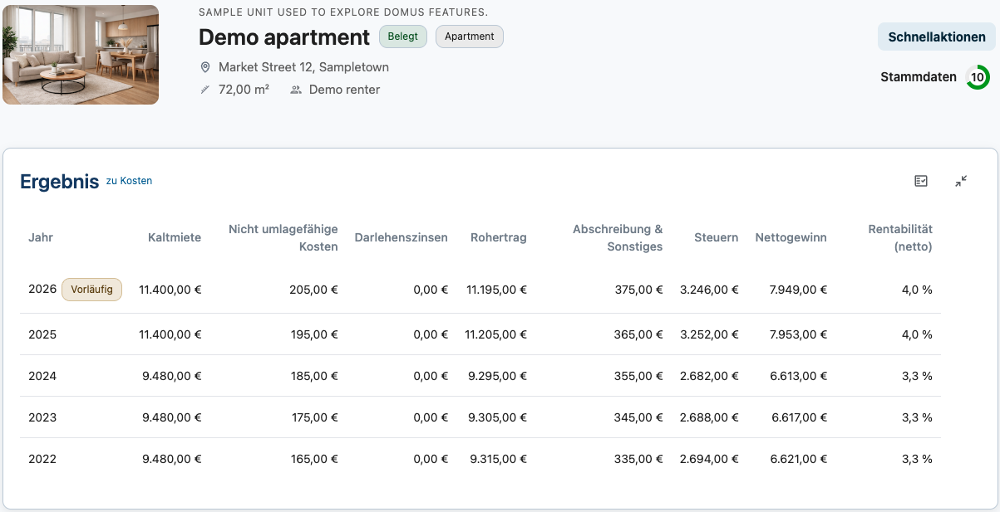

<!--
SPDX-FileCopyrightText: 2025 Marcel Scherello
SPDX-License-Identifier: AGPL-3.0-or-later
-->

# Domus

Domus bündelt die Verwaltung Ihrer Mietobjekte in Nextcloud: von Objekten und Einheiten über Mietverhältnisse und Kontakte bis zu Buchungen, Dokumenten und Aufgaben.

Ob einzelne Wohnung oder mehrere Objekte: Sie finden die zugehörigen Informationen an einem Ort und behalten anstehende Arbeiten im Blick.

## Vorschau

    
    
    
    
  

## Warum Sie es nutzen
- Verknüpfen Sie Einheiten, Mietverhältnisse, Kontakte, Buchungen und Dokumente.
- Vergleichen Sie vereinbarte Mieten mit erfassten Buchungen und sehen Sie offene Aufgaben.
- Finden Sie Dokumente und Notizen im Zusammenhang mit dem jeweiligen Objekt wieder.
- Nutzen Sie Dashboard und Auswertungen für den Überblick über Ihre Vermietungen.

Entwickelt für Vermieter und kleine Hausverwaltungen, die einen klaren Überblick im Alltag wollen und ihre Daten trotzdem privat in Nextcloud behalten möchten.

## Was Sie damit tun können
- Für jedes Objekt oder jede Einheit eine klare Übersicht führen.
- Mietverhältnisse, Kontakte und Mietzeiträume im Blick behalten.
- Einnahmen und Ausgaben als Buchungen erfassen und Dokumente zuordnen.
- Einzelne Aufgaben und mehrstufige Prozesse verfolgen.
- Buchungen nach Jahr, Einheit und Konto auswerten.

## Sprachen
- EN, DE

## Maintainer
- [Marcel Scherello](https://github.com/rello) (author, project leader)

## Unterstützung
Unterstützt von PhpStorm von [JetBrains](https://www.jetbrains.com/?from=AudioPlayerforNextcloudandownCloud)

  

